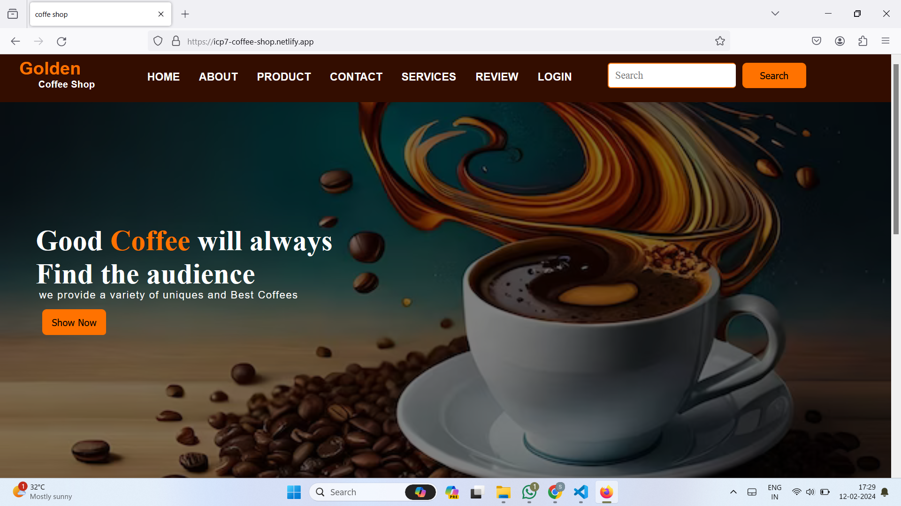
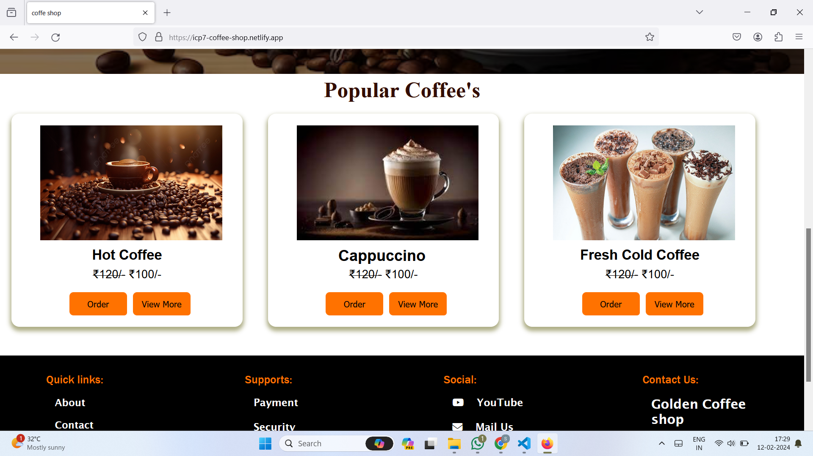
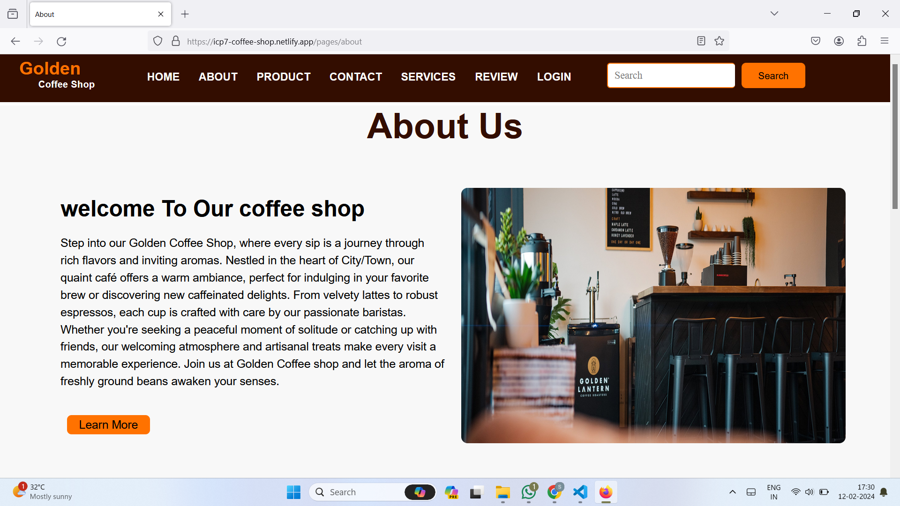
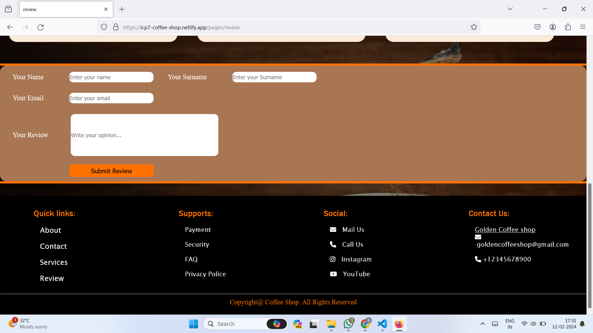
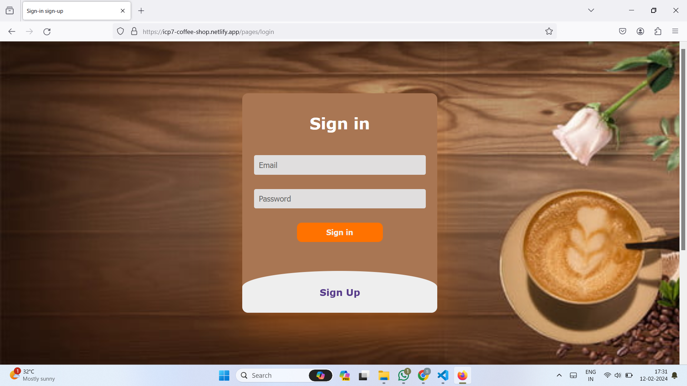
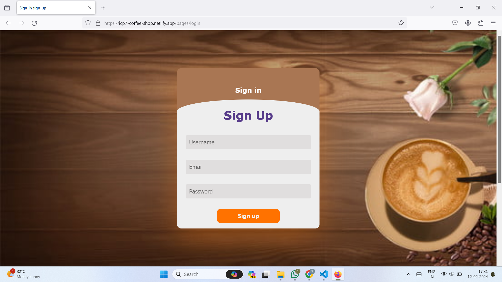

## icp-7-group-3-html-css--project-1

# Coffee Shop 
##  Welcome To Our coffee shop...

### The following are images from the website :

###  Home Page

###  popular Product Page

###  About Page

### Footer Section

### sign-in page

### sign-up page

### Description 
The project is made using the basics of **HTML**  and **CSS**.
The website is the frontend implementation of a Coffee Shop.

### Description of work :

Every member created a page in the project

1. Home Page - Sakshi Gore
2. Product - Monika Kabelekar
3. About-  Vedant
4. Order - vedant 
5. Contact - Anshita
6. Services - Pooja Pathak
7.  Review - Sahil 
8. Login - Gitanjali dolas
9. Register - Gitanjali dolas

